#  PiFire
## Raspberry Pi Zero W based Smoker Grill Controller using Python 3 and Flask/Gunicorn/nginx
*Also uses Bootstrap 4 (http://getbootstrap.com/) w/jQuery and Popper support*

***Note:*** *This project is continuously evolving, and thus this readme will likely be improved over time, as I find the inspiration to make adjustments.  That being said, I'm sure there will be many errors that I have overlooked or sections that I haven't updated. This project is something I've done for both fun and for self-education.  If you decide to implement this project for yourself, and run into issues/challenges, feel free to submit an issue here on GitHub.  However, I would highly encourage you to dig in and debug the issue as much as you can on your own for the sake of growing your own knowledge.  Also, I have a very demanding day job, a family, and lots of barbeque to make - so please have patience with me.*

***Warning:*** *The creator of this project takes no responsibility for any damage that you may do to your personal property including modifications to your smoker grill if you choose to use this project.  The creator also takes no responsibility for any resulting harm or damages that may come from issues with the hardware or software design.*  ***This project is provided for educational purposes, and should be attempted only by individuals who wish to assume all risks involved.***


### Introduction
This project was inspired by user dborello and his excellent PiSmoker project (http://engineeredmusings.com/pismoker/ and https://github.com/DBorello/PiSmoker).  I encourage you to check it out and get a rough idea of how this all works.  This particular project was built around a Traeger Texas smoker grill platform, but should work for most older Traeger models (or other brands with similar parts like the older Pit Boss) built with similar parts (fan, auger, and igniter).  I've built the code in a way to be somewhat modular & extensible such that you can replace the grill platform with your own specific platform instead.  Newer Traeger grills with their newer wifi enabled controllers have DC components (instead of the AC Fan / Auger) and aren't covered by this project.  

Just as with the PiSmoker project, I had a few goals in mind.  I also wanted to have tighter temperature controls, wireless control, and plotting of the grill / meat temperatures.  In addition, I wanted to design this project such that original smoker controller could be used if needed.  This way, if I wanted to, I could use my controller as a monitoring device for temperatures instead of controlling the temperature and leave that up to the original controller.  Basically, it was my fallback plan in case my project didn't work out, or if I wanted to do a quick cook on the Traeger without using the fancy GUI.  

I made some other choices that diverged from the PiSmoker project as well.  

1. I've decided to use a Raspberry Pi Zero W, to both improve the compact nature of the controller and to provide in-built WiFi support.  It seems that that Pi Zero has enough horsepower to do what we need here.  And it's small enough to fit inside most small project boxes.
2. I'm using Flask to provide a WebUI framework for the application.  Firebase was a good solution at the time, but given that it's not longer usable, I've created the web based interface to be used from a mobile device, tablet or computer.  
3. Instead of using the MAX31865 RTD ADC, I'm using an off the shelf ADC solution based on the ADS1115 device which seems to be readily available on sites like Amazon and Adafruit.  It also supports I2C, which makes the hardware design easier in my humble opinion. This does make the code a little more fiddley, because we will need to find and use coefficients for each probe type and the Steinhart-Hart formula to calculate temperatures reasonably accurately. Many thanks to the HeaterMeter project for providing inspiration on both the hardware and software implementation. (https://github.com/CapnBry/HeaterMeter)
4. Instead of using the LCD Display from Adafruit, I'm using a cheap and ubiquitous OLED device (SSD1306) that I happened to have on hand already.  It also supports I2C, so again less hardware design necessary to get things designed into the project.  It also can be supported via either the Adafruit Python libraries or the Luma Python libraries (which I used for this project).  This display is frankly very small and someday, I may consider upgrading to something a bit larger, but for now, I'm reasonably happy.  
5. As mentioned above, since this thing sits along side the existing controller, I designed this to use more relays to allow for selecting between the two.  This certainly can be modified to ignore the existing controller altogether, but I didn't want to be without my grill while I fiddled with this project.
6. Another software choice was to modify the OS install such that the /tmp folder is RAM.  This way, I can store much of the history and control data in memory instead of writing to the flash device constantly and causing it to wear out.  Luckily, this is a pretty simple prospect with Rasperry Pi OS and is handled in the setup below.  

What I did keep from dborello's project was the PID controller which was the heart of the project.  This file is largely untouched from his project intentionally so that I could retain the goodness and legacy of his great work.  This project itself would not be possible without his pathfinding and generous sharing of the knowledge.

### Screenshots & Videos

The dashboard is where most of your key information and controls are at.  This is the screen that greets you when you access the PiFire WebUI on your PC, Mac or Tablet in a browser.


For those of us who like to see the data, PiFire allows you to graph and save your cook history.  It's also a great way to monitor your cook in realtime.  


This is what PiFire looks like on your mobile device.


Example comparison that I did on a real cook of the Traeger controller attempting to hold 275F and the PiFire holding at the same temperature.  The difference is very impressive.  The Traeger swings massively up to 25F over and under the set temperature.  However the PID in from PiSmoker does a great job holding roughly +-7 degrees.  And this is without any extra tuning. 


Here's a brief YouTube video giving a basic overview of the PiFire web interfaces.

##### PiFire Demo Video

[](http://www.youtube.com/watch?v=ni4YX5BMBWQ)

A shot of the splash screen on the display when booting up.  

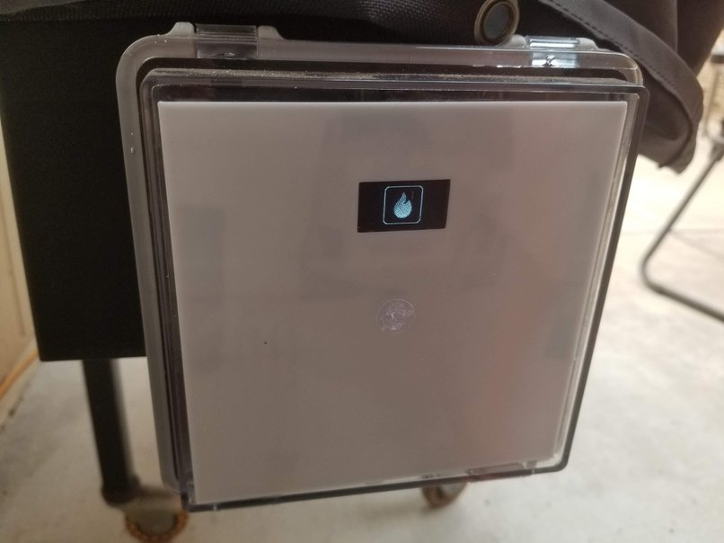

Typical temperature display for the grill. [Edit: The display has been enhanced to show status for the fan, auger, igniter, mode and notifications]

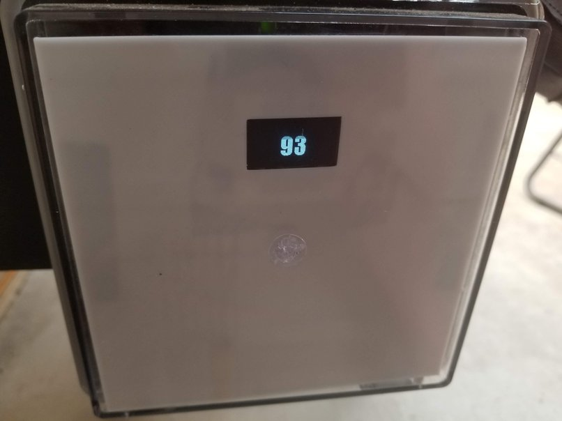

## Hardware Configuration

### The Parts List
The parts list and setup:

* **Raspberry Pi Zero W** - Technically any Raspberry Pi with WiFi will do fine, but for this application a Raspberry Pi Zero W works really well and is the right price.
* **4-Channel Relay** - Needed for controlling all of the 120V outputs (Fan, Auger, Igniter, Power) [Amazon Link](https://www.amazon.com/JBtek-Channel-Module-Arduino-Raspberry/dp/B00KTEN3TM)
* **Resistors** - (3x) 10k ohm resistors for grill RTD and meat probes resistor divider.  You may want to consider getting some decent quality tolerance resistors for this given that accuracy is important.  I managed to source some pretty accurate dividers. (1x) 330 Ohm resistor for power selector switch.    
* **Micro SD Card** - Greater than 4GB is probably good.  
* **120V AC to 5VDC Power Supply** - In this particular case it's a 5V5A output which can be connected to the relay as well! [Amazon Link](https://www.amazon.com/gp/product/B07B111B7Y)
* **SSD1306** - Standard 1" OLED display.  It's pretty tiny, but it does the job and it can be found very cheap if you are willing to order direct from China. [Amazon Link](https://www.amazon.com/UCTRONICS-SSD1306-Self-Luminous-Display-Raspberry/dp/B072Q2X2LL)
* **ADS1115** - Popular I2C based 16bit Analog to Digital Converter.  [Amazon Link](https://www.amazon.com/conversor-anal%C3%B3gico-desarrollo-amplificador-unidades/dp/B082QX1RDV)
* **Molex Connectors** - This is a super critical to making this a seamless integration of the controller.  This basically allows you to easily plug into the existing connections on the smoker.  I would highly recommend purchasing a wire crimping tool, and watch some youtube videos to understand how these connectors work.  Careful not to trim too much off of the leads so that they do not slide through the connector.  [Amazon Link](https://www.amazon.com/gp/product/B074G5PQHL)
* **2.5mm Mono Audio Jack** - Your mileage may vary with these and thus I am not putting any links to recommendations here.  These are used for the meat probes, but I've found the quality of these jacks can be generally very poor.  In some cases, the plugs will not stay put in the jacks, so you may have to do some tweaking of the mechanical bits to get them to stay.  If anyone has a good reliable source for these, I'd happily provide a link here.  
* **RTD1000 Traeger Temp Probe** - I decided to use a completely separate temperature probe for the actual pit temperature because I was too lazy to implement a solution to use the existing temperature probe.  I'll provide a link to Amazon here, but you can also order much cheaper versions of the same thing on Ebay.   [Amazon Link](https://www.amazon.com/QuliMetal-Temperature-Replacement-Traeger-Thermostat/dp/B07JYYBVQ7)

### Hardware Schematics

Let me first say that I am not a hardware engineer by trade and thus there may be mistakes in what I'm providing here.  I would encourage you to use this as a guide, but know that it isn't perfect by any means.  Do let me know if there are any improvements that you can see for this.  

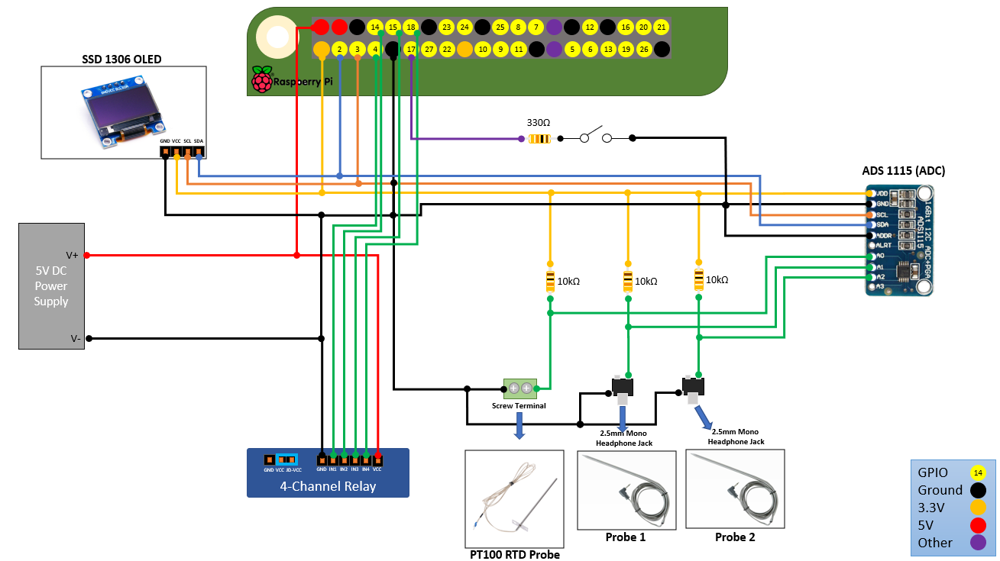

To ease the wiring, I had a simple PCB printed. If you are so inclined, I've made it available here: https://easyeda.com/nebhead77/pifire

This PCB allows you to plug the ADS1115 into the header on the right side of the board with no additional wiring.  It's definitely not necessary, but it makes wiring / soldering just a little bit easier.  In the future, I may consider to redesign this as a "HAT".  

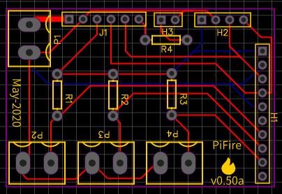

Here's a 3D-View of the board.  

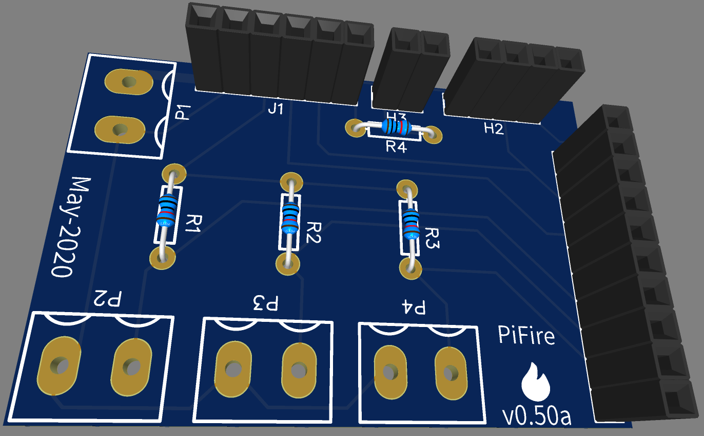

And here's a picture of the real thing all built out.

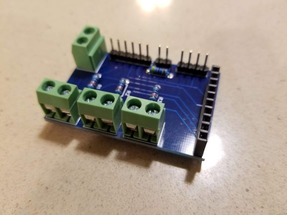

The following is a rough schematic of the relay side of the of the design. Basically this is what allows you to control the Fan, Auger, Igniter and Power as well as switch between the existing controller and the PiFire controller via software.

Note that wire colors may vary with different models of grills. I've tried to use the standard wire colors here that you may actually see, but if you've swapped out any components or have a newer/older version they may be different.  

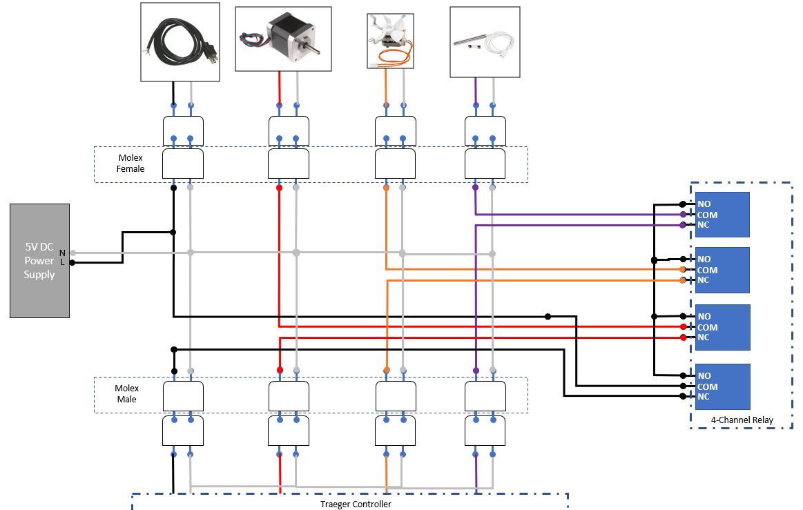

### Raspberry Pi GPIO / PIN Mapping

__Relay Control (defined in common.py):__
* **GPIO 4** - Power (controls power to the outputs, between the existing controller and the PiFire controller)
* **GPIO 14** - Auger Relay - Controls the Auger on/off.
* **GPIO 15** - Fan Relay - Controls Fan on/off.
* **GPIO 18** - Igniter Relay - Controls Igniter on/off.

__Switch Input (defined in common.py):__
* **GPIO 17** - Switch Input for system on/off

### The Hardware in Pictures

Sometimes it's helpful to see the entire project laid out in picture form, so I've tried to put together some helpful pictures.  

Here's a diagram showing all of the major components in the project box and how I laid them out.  Certainly, you can do this differently but this was how I did it.  Much hot glue and electrical tape was used.  Please don't judge.

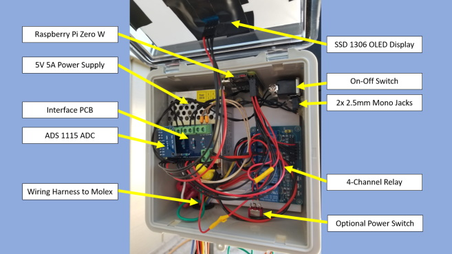

I'm not sure about other brands, but Traeger designed their Texas grills with handy Molex connectors for everything that hooks up to their controller.  It makes the electronics underneath extremely serviceable and allows us to rather seamlessly connect our project in between.

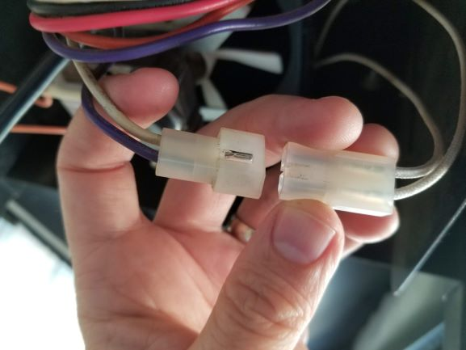

The following is a picture of the project from the outside.  You can see that the OLED is mounted to the front of the box which has a clear lid.  I put a piece of white plastic in the front to hide the electronics inside.  The wiring with the molex connectors is fed through the bottom of the box to underneath smoker pellet box where all of the connections can be made.  I've zip-tied the wires together, tucked them up in side the pellet box area, and made it nice and tidy.  

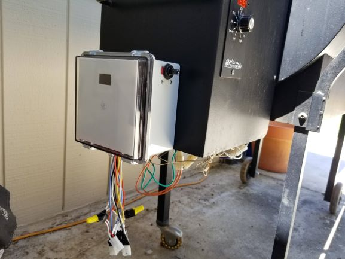

On the bottom of the  project box, I have drilled decent sized hole and installed a rubber grommet (to protect the wires) for all of the 18AWG wiring to be routed through.  There are quite a few wires coming out, so it's good to give yourself some space, but maybe not too much given that your grill may exposed to the elements outside.  It should be snug.

I also have an optional power switch down here, that is a normally closed momentary switch.  This wired between the 5V power supply and the Raspberry Pi so that I can do a hard power-cycle when necessary.  Or if the Raspberry Pi is off, a power cycle will boot it up again.  

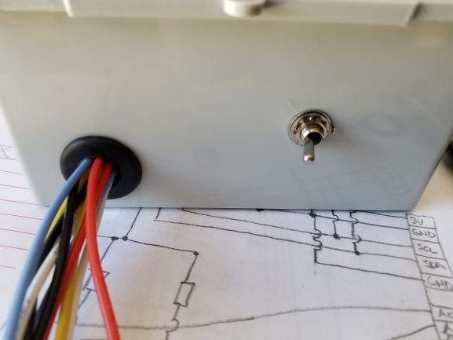

Around to the side facing the user (in my configuration), you'll see we have rather large selector switch which is used to select whether you are using the original controller (OFF) or the PiFire controller (ON).  

Below this, are two 2.5mm mono jacks for plugging in your two meat probes.  These were a bit fiddley to install, but I managed to hotglue them in place on the inside - and they feel really solid.  *EDIT:* I've removed the hotglue for the 2.5mm mono jacks and replaced it with copious amounts of superglue.  With temperatures rising above 100F here in Northern California, the hot glue softened too much to be mechanically sound.  Some day I might have to come up with another solution, but for now, super-glue is doing the trick.

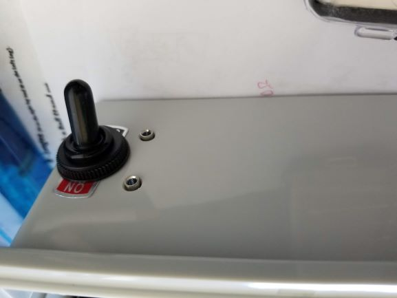

A few more photos can be found in the [/docs/photos](/docs/photos) folder of this repository if you are interested in seeing more.  

## Software Installation

### Raspberry Pi Zero Initial Headless Setup

Once you've burned/etched the OS image (I prefer to the Raspberry Pi OS Lite) onto the microSD card, connect the card to your working PC and you'll see the card being mounted as "boot". Inside this "boot" directory, you need to make 2 new files. You can create the files using a text editor editor.

+ Step 1: Create an empty file. You can use Notepad on Windows or TextEdit to do so by creating a new file. Just name the file `ssh`. Save that empty file and dump it into boot partition (microSD).

+ Step 2: Create another file name wpa_supplicant.conf . This time you need to write a few lines of text for this file. For this file, you need to use the FULL VERSION of wpa_supplicant.conf. Meaning you must have the 3 lines of data namely country, ctrl_interface and update_config

```
country=US
ctrl_interface=DIR=/var/run/wpa_supplicant GROUP=netdev
update_config=1

network={
    ssid="your_real_wifi_ssid"
    scan_ssid=1
    psk="your_real_password"
    key_mgmt=WPA-PSK
}
```

#### Power-On, Log In, and Run RasPi-Config (REQUIRED PRE-REQUISITE FOR AUTO-INSTALL)
Now you can power-up your Raspberry Pi with your microSD card inserted, and connect to it via SSH.  If you're on a Linux PC, use the command line connect to your Pi.

```
ssh pi@192.168.10.xxx
```

If you're on a Windows PC, you can use Putty to SSH to your Pi, or you can install the Windows Subsystem for Linux and install a Linux image like Ubuntu to run the above command.  

Once connected, you'll want to run raspi-config to get the system setup.  

```
sudo raspi-config
```

Once raspi-config is open, the following should be configured at a minimum.

1. Set locales (Always good practice.  For US English, I typically use EN UTF8)

2. Set timezone (This ensures you have the right time in your dashboard)

3. Replace Hostname with a unique hostname ('i.e. pifire')

4. Enable I2C under Interfacing Options

	* Use the down arrow to select 5 Interfacing Options
	* Arrow down to P5 I2C
	* Select yes when it asks you to enable I2C
	* Also select yes when it asks about automatically loading the kernel module
	* Use the right arrow to select the <Finish> button

**i2c Fast Baudrate** (https://luma-oled.readthedocs.io/en/latest/hardware.html#pre-requisites) Optionally, to improve performance, increase the I2C baudrate from the default of 100KHz to 400KHz by altering `/boot/config.txt` to include:

```
dtparam=i2c_arm=on,i2c_baudrate=400000
```

**Notes for the Raspberry Pi 3B, 3B+ and Zero W** (https://www.abelectronics.co.uk/kb/article/1089/i2c--smbus-and-raspbian-stretch-linux)

The I2C controller on the Raspberry Pi 3B, 3B+ and Zero W has its clock linked to the VPU core so as the VPU frequency changes depending on processor load so does the clock rate of the I2C bus.  This can cause problems with any devices that expect a constant clock rate during communication.

To solve this issue the VPU core frequency must be set to a fixed frequency by editing /boot/config.txt.  Open the file with nano using the command:
```
sudo nano /boot/config.txt
```
Add the following text to the bottom of the file.

```
core_freq=250
```

Save your changes, exit the nano editor and reboot

```
sudo reboot
```

### Automatic Software Installation (Recommended)

I've created a script to install this automatically.  Your mileage may vary, and if anything fails, you may just want to try running the manual steps below.  

*NOTE: This script requires that you install on the 'pi' user account, otherwise the supervisor portion of the install will likely fail.*

After you've done the above steps to configure your raspberry pi, at the command line type the following:

```
curl https://raw.githubusercontent.com/nebhead/pifire/main/auto-install/install.sh | bash
```

OR you may find that it is more reliable to download the script to your raspberry pi first, and execute directly.

```
wget https://raw.githubusercontent.com/nebhead/pifire/main/auto-install/install.sh
./install.sh
```

Follow the onscreen prompts to complete the installation.  At the end of the script it will reboot, so just be aware of this.  

### Manual Software Installation (Recommended)

*NOTE: This installation assumes that you install on the 'pi' user account, otherwise the supervisor portion of the install will likely fail.  If you are using a different user account, make sure you modify the correct folder structures in the supervisor configuration files.*

Let's start by setting up the /tmp folder in RAM.  On your Pi, open the fstab file for editing:

```
sudo nano /etc/fstab
```

Add the following line to the bottom of the file.  

```
tmpfs /tmp  tmpfs defaults,noatime 0 0
```

Save and exit.  

#### 1. Install Git, Python PIP, Flask, Gunicorn, nginx, luma.oled, ADS1115, Pillow, supervisord and other dependancies
```
sudo apt update
sudo apt upgrade
sudo apt install python3-dev python3-pip python3-pil libfreetype6-dev libjpeg-dev build-essential libopenjp2-7 libtiff5 nginx git gunicorn3 supervisor ttf-mscorefonts-installer -y
sudo pip3 install flask luma.oled ADS1115

git clone https://github.com/nebhead/pifire
```

#### 2. Setup nginx to proxy to gunicorn

```
# Move into install directory
cd ~/pifire

# Delete default configuration
sudo rm /etc/nginx/sites-enabled/default

# Copy configuration file to nginx
sudo cp pifire.nginx /etc/nginx/sites-available/pifire

# Create link in sites-enabled
sudo ln -s /etc/nginx/sites-available/pifire /etc/nginx/sites-enabled

# Restart nginx
sudo service nginx restart
```

#### 3. Setup Supervisor to Start Apps on Boot / Restart on Failures

```
# Move into garage-zero install directory
cd ~/pifire/supervisor

# Copy configuration files (control.conf, webapp.conf) to supervisor config directory
# NOTE: If you used a different directory for garage-zero then make sure you edit the *.conf files appropriately
sudo cp *.conf /etc/supervisor/conf.d/

# If supervisor isn't already running, startup Supervisor
sudo service supervisor start

# If supervisor is running already, just reload the config files
sudo supervisorctl reread
sudo supervisorctl update

# Or just reboot and supervisord should kick everything off
sudo reboot
```
Optionally, you can use supervisor's built in HTTP server to monitor the scripts.  It's highly recommended to enable this feature as it may come in handy in the future if any scripts misbehave.  

Inside of `/etc/supervisor/supervisord.conf`, add this:

```
[inet_http_server]
port = 9001
username = user
password = pass
```
If we access our server in a web browser at port 9001, we'll see the web interface that shows the status of the two scripts (WebApp and Control).  This gives you a quick and easy way to monitor whether any of the scripts has stopped functioning.  

## Using PiFire
If you've configured the supervisord correctly, the application scripts should run upon a reboot.  Once the system is up and running, you should be able to access the WebUI via a browser on your smart phone, tablet or PC device.  

Simply navigate to the IP address of your device for example (you can usually find the IP address of your device from looking at your router's configuration/status pages). My router typically assigns IPs with prefixes of 192.168.10.XXX.  I'll use examples on my home network here, so you'll see URLs like: http://192.168.10.42  Yours may look different depending on your routers firmware/manufacturer (i.e. 10.10.0.XXX, etc.)

**Note:** It's highly recommended to set a static IP for your Pi in your router's configuration.  This will vary from manufacturer to manufacturer and is not covered in this guide.  A static IP ensures that you will be able to access your device reliably, without having to check your router for a new IP every so often.   

#### The Dashboard
The interface / webui is broken out several pages. The first is the dashboard view where you can check the current status of the grill, and control the modes. Clicking the PiFire logo in the upper left will always take you back to the dashboard from whatever screen you are on.  


Pressing the hamburger icon in the upper right of the interface, allows you to also access to the other screens.  

Initially you will have three controls at the bottom of the screen.

* **StartUp Mode** (Play Icon) - If you select this mode, you grill begin to start up by turning on the fan, the igniter and will cycle the auger a predefined amount from the settings.json.  The igniter will stay on for the entirety of startup mode which is set to four minutes by default.  Once the time has elapsed, startup mode will end and it the grill should transition to smoke mode.  

* **Monitor Mode** (Glasses Icon) - If you have your original controller running and you want to just monitor the temperatures of the grill and use the meat probes, you can do this by selecting this mode.  This way you can still set/get notifications, or monitor the temperatures of the meat or grill remotely.

* **Stop Mode** (Stop Icon) - The default mode when the system is turned on is stop mode.  In this mode, the grill will not be sampling temperatures and will not be controlling the grill at all. Effectively, the PiFire controller is OFF and you can safely use the original controller.  

After you select startup, you will see the following icons:

* **StartUp Mode** (Play Icon) - This will continue to be displayed for the duration of the startup cycle (4-minutes by default), then should disappear after transitioning to the next mode (smoke mode by default).  

* **Smoke Mode** - In this mode, the smoker will cycle through a predetermined cycle from the settings.json, that is intended to generate smoke.  Just like your original controller, smoke mode isn't trying to hit a temperature target, rather it is running through a fixed cycle of turning on/off the auger to feed more pellets into the firepot.   

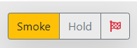

* **Hold Mode** - This mode uses the PID controller (pid.py) developed by dborello for the PiSmoker project.  More details can be found on his blog about how this works.  Basically we use his algorithm to try to hold a specific temperature, by feeding the fire at intervals that are dynamically calculated at the end of each cycle.  It's really very interesting stuff and it can work very well.  I personally am looking forward to tuning this more so that I can keep the temperature closer to a +/-5F hold.   

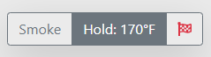

* **Shutdown Mode** (Finish Flag Icon) - This mode simply shuts off the auger and keeps the fan running for 60 seconds to burn down some of the remaining pellets.  It's a bit more graceful than just turning off the grill immediately.  Once the controller finishes the shutdown cycle, you'll see the original startup, monitor and stop buttons again.  

**Timer** - Relatively self explanatory, but you can set a timer which will send a notification (if enabled) when it expires.  This timer will be visible at the top of the dashboard while running and can be paused, stopped, started from there.  The timer will also be visible on the history screen for convenience.  

##### A Note on "Safety" Features

PiFire has some basic built in safety features which are configurable in the settings section.

* **Low Temperature Shutdown** - If you're like me, you may have experienced your fire going out in the firepot which leads to the grill dumping it's entire load of pellets into barrel.  This is both a pain to clean up and something that is completely avoidable.  PiFire will check the temperature before startup, after startup and during Smoke and Hold modes to ensure that the temperature never drops below the startup temperature.  If it does, it will immediately stop the grill, and send a notification (if notifications are enabled).  Note that this is not checked during Monitor mode.     

* **High Temperature Shutdown** - Now, I've never had this happen to me, but it might be possible to exceed safe temperature limits in your smoker grill.  During, startup, smoke, hold and monitor modes, PiFire will monitor the temperature to make sure it doesn't exceed the maximum grill temperature set in the settings.json file. If the temperature exceeds these levels, PiFire will immediately stop the grill, and send a notification (if notifications are enabled).

Example of icon that appears in error conditions:

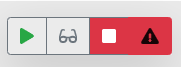

#### Settings

The settings page has several card sections that can modify the settings/behavior of PiFire.  

**Probe Settings & Probe Profile Editor** - In the Probe Settings you can select the probe profiles that you want to use for the Grill, and the two food probes.  By default, I've included profiles for the probes that I have on hand at home and have been able to find coefficients for from various forums (Heatermeter / Skyperry).  In this card you can also turn on / off the visibility of the probes on the main dashboard.  

The profile editor allows you to modify the existing probe profiles or add your own new probe profile.  If you get add something new or improve upon the default probe profiles, feel free to submit a pull request in the future.  
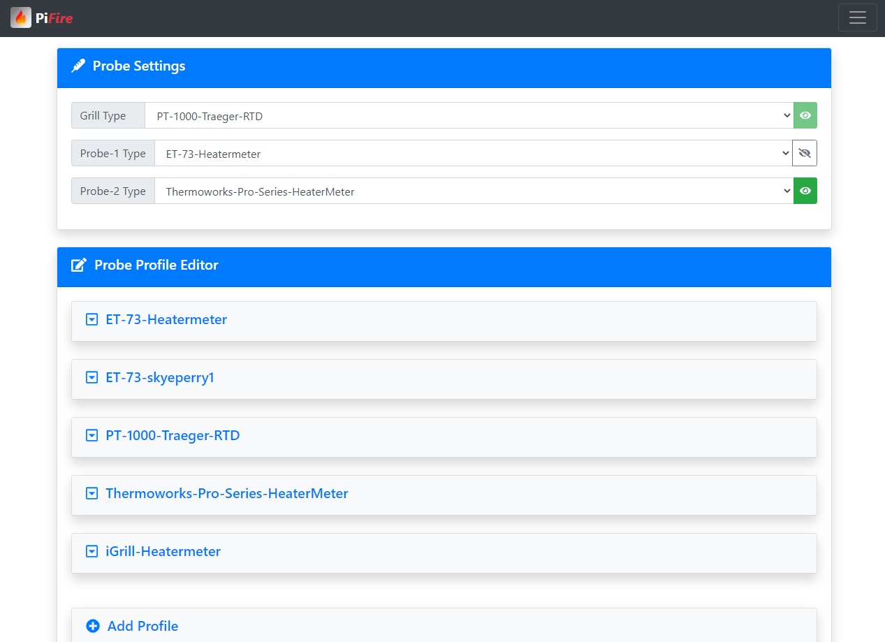
When adding a new profile, these are the configurable settings:
* _Unique ID_ - This can be really anything, but it should be unique and typically one word or multiple words without spaces so that it's machine readable.  This is used by PiFire to sort the list, identify a profile and load a profile internally.  
* _Name_ - More free-form text field for the human readable name. I've chosen to put dashes between words, but it's probably not necessary.
* _Vs_ - This is the voltage of the source.  Because we're dealing with calculating temperature, precision is important.  Thus, just using 3.3V for the source voltage could throw off the resistor divider calculations, given you a different calculated resistance across the probe.  This could lead to inaccurate temperature readings.  It is highly recommended to use a multimeter to measure the voltage source on the 3.3V rail.  For the defaults in PiFire, I've used 3.28V which is what I measure on my build.  
* _Rd_ - This is the value of your R1 resistor in Ohms in the resistor divider circuit.  As mentioned in the hardware parts list, you should try to get a resistor that has good tolerance to ensure accuracy.  However, if you have resistors that might slightly off, you can modify the value here.  
* _Coefficient's A,B,C_ - These are the coefficient values that are used in the Steinhart-Hart equation which will determine the temperature based off of the resistance of the probe determined above.  This equation is regarded as the best mathematical expression for the resistance - temperature relationship of thermistors.  More information about Steinhart Hart can be found in the [Wikipedia](https://en.wikipedia.org/wiki/Steinhart%E2%80%93Hart_equation) article.  Coefficients can be derived by measuring the resistance of your probe across the operating range of temperature points.  Once you have that data, there are online calculators that can produce the coefficients for you. I used [this](https://www.thinksrs.com/downloads/programs/therm%20calc/ntccalibrator/ntccalculator.html) calculator to determine coefficients for my RTD probe.  Or, as mentioned before, you can lift these coefficients from other projects like [HeaterMeter](https://github.com/CapnBry/HeaterMeter) or [this project by Skyeperry](https://github.com/skyeperry1/Maverick-ET-73-Meat-Probe-Arduino-Library) on GitHub.   

**Pro Tip:** Lot's of wonderfully good information can be gathered from [HeaterMeter's Probe documentation](https://github.com/CapnBry/HeaterMeter/wiki/HeaterMeter-Probes). This is all mostly relevant to this project as well, since the design is basically the same.  

**Cycle Settings** - PMode (Startup/Smoke): PMode is a way to set the auger off time during the Startup and Smoke cycles.  The default value is 2, which will run the auger on for 15 seconds and then off for 65 seconds during a single cycle. Depending on the outside temperature, you may want to decrease this value for colder environments or increase this value for warmer environments.  This helps you dial in the temperature of the smoke cycle so that it is not too high or too low.    
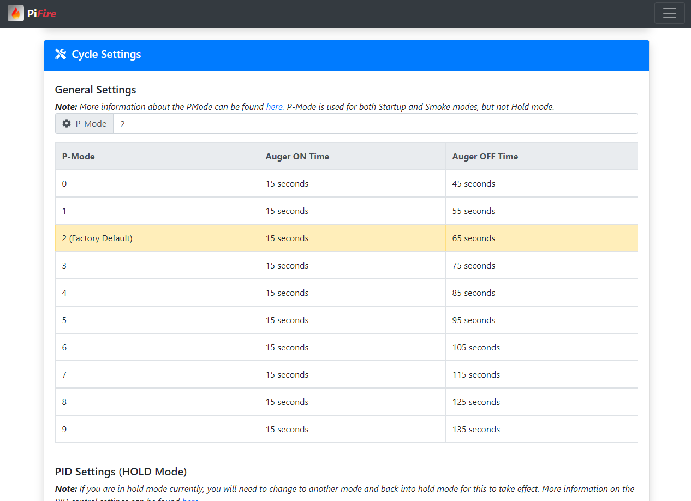

**Cycle Settings** - PID (Hold Mode): To hold a set temperature, PiFire utilizes a PID controller which was designed by [Dan Borello](http://engineeredmusings.com/pismoker/) for the [PiSmoker](https://github.com/DBorello/PiSmoker) project.  For more information about his PID controller, check out his [blog](http://engineeredmusings.com/pismoker/). I am humbled by his work and thus utilized his controller with almost no modification in this project.  
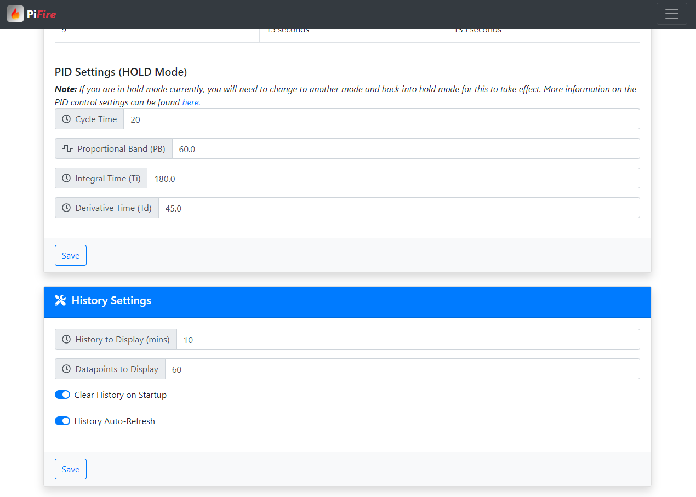

**History Settings** - Miscellaneous settings for the history page.  You can define the number of minutes to display on the chart, so that you can effectively zoom in or out on the data.  You can also define how many datapoints to display on the chart, which can help improve performance when doing auto-refresh.  Basically, PiFire will divide the number of datapoints accross the window of time that you have selected.  Clearing history on startup, will clear the history when startup mode is selected.  This basically starts your cook with a clean slate of data.  The last option is auto-refresh default which will make the chart auto refresh every three seconds, giving you a live view of temperature.  

**Safety Settings** - As mentioned in the Note on Safety features section above, this allows you to define the temperature settings to activate those features.  

* Preventing Firepot Overload - PiFire will sample the grill temperature at the beginning and end of startup to set a safe minimum temperature to operate.  If the grill temperature drops below this temperature, it will stop the grill and send a notification of an error to prevent firepot overload.  
	* _Min Startup Temp_ - If after the startup cycle has completed, the temperature has not exceeded this temperature, the grill will go into stop mode.    
	* _Max Startup Temp_ - If after the startup cycle has completed, the temperature of the grill exceeds this temperature, it will set the minimum safe temperature to this value.  This is to prevent the grill from shutting down pre-maturely if the startup temperature was high. 
	* _Reignite Retries_ - If the grill temperature drops below the startup temperature, attempt reignite.  This number can be set to up to 10 total retries before failing.   
* Preventing Grill Overtemp - PiFire will monitor the grill temperature during Smoke, Hold and Monitor modes to ensure that the grill does not exceed the _Max Operational Temp_ setting defined here.  

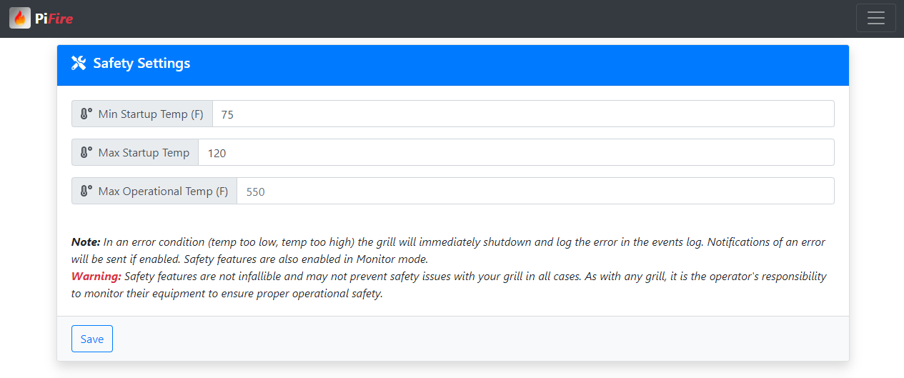

**Page Settings** - Currently allows the user to enable a dark theme for night-time viewing or if just preferred.  

**Notification Settings** - If you don't want to enable notifications, ensure that all the fields with this section are left blank.  If you want to utilize notifications, you can fill in the information for the notification services that are available.  At the time of publishing, IFTTT and Pushover notifications are supported.  If you currently use one of these services you can setup your appropriate keys and settings to enable them.  

IFTTT requires more configuration on the IFTTT website and is not in the scope of this documentation.  However, the following are valid events:

* Grill_Temp_Achieved
* Probe1_Temp_Achieved
* Probe1_Temp_Achieved
* Timer_Expired
* Grill_Error_00
* Grill_Error_01
* Grill_Error_02
* Grill_Warning

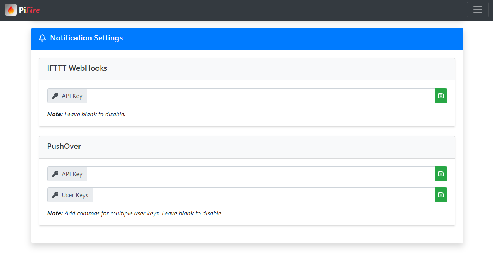

#### History

The history page provides a simple line-graph plot of the current history.  In the upper right hand corner of the history chart card is a trash can icon which will allow you to delete the current history.  You might want to do this if the history file has gotten too big or if you want to start a new cook.  By default, on startup, the history will be erased.  Also in the upper right corner of the chart card is a icon for exporting the data to CSV file.  This is useful for those who might want to look at the data in Excel, or other spreadsheet software.  

The chart itself can be interacted with by hovering (or clicking on) the data points.  Some of the lines/data in the legend will likely have a stikethrough, meaning it is not currently displayed.  You can click those legend items to make them visible on the chart.  Conversely, if you want to make a data-set invisible, simply click the legend item.   

At the bottom of this card is an input box to select the number of minutes you want to see, up to the current time (or time that the data collecting stopped).  This allows you to "zoom-in" to just the last minute or "zoom-out" to view a longer window of time.  

At the bottom of the page is a auto-refresh button to enable/disable 'live' data.  Note that when auto-refresh is enabled, any changes you made to hide/show data in the graph will reset when the data refreshes every three (3) seconds.  Show / Hide states cannot currently be used when in this mode.  Turn off auto-refresh to use the show / hide features of the graph.  


#### Events

This page provides limited history of the events since the system was turned on.  This event history will be cleared on a reboot or, may be erased in the Admin Settings screen.

If debug mode is enabled, it will be displayed underneath the events history card.  Debug information will generally be more verbose than the event history.  Just like the event history, it will be cleared on a reboot or may be erased in the admin settings screen.  It's advisable to only turn on debug mode (in Admin Settings) if you are experiencing problems as this can affect performance of the system.  

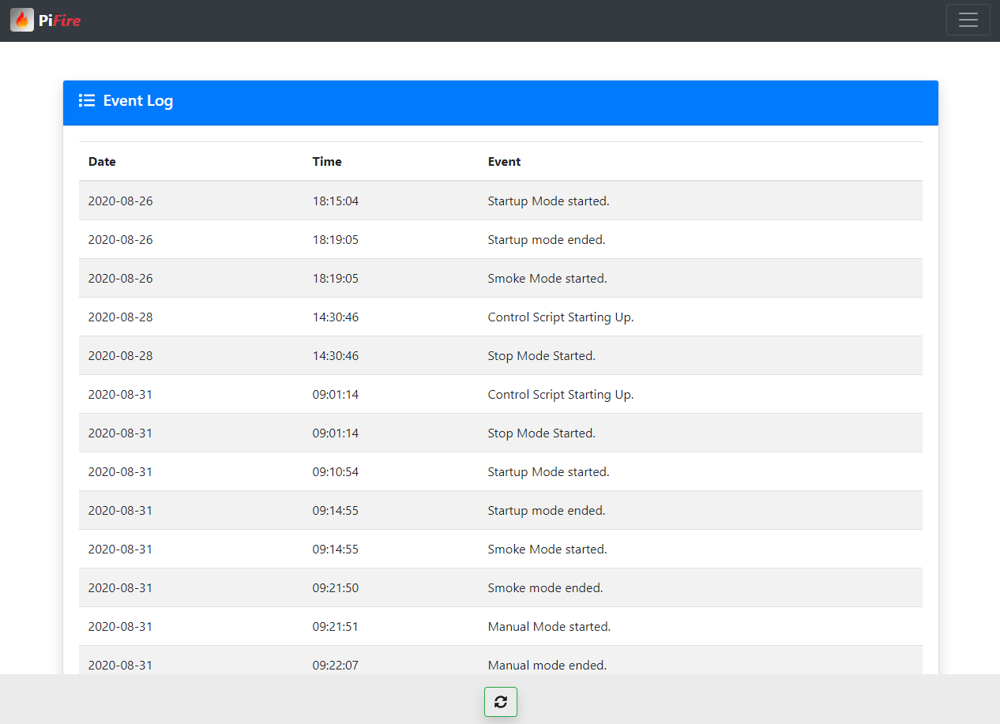

#### Recipes

To be implemented.

#### Admin Settings

In the admin settings page, you can set global settings that will configure the system.  These include turning on debug mode, enabling manual mode, and resetting data for the different components (or ALL with Reset Factory Settings)

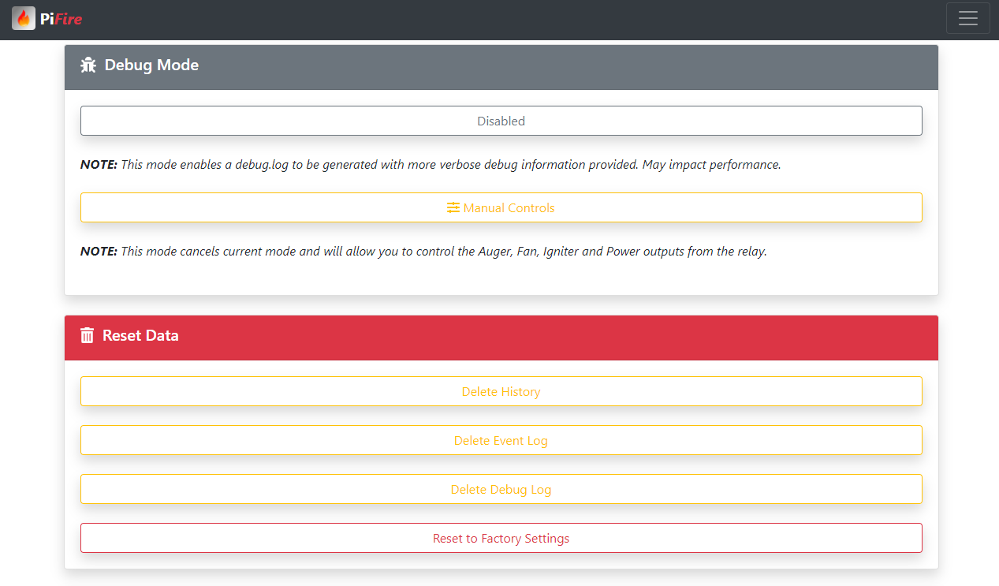

Scrolling down further gives you the option to reboot the system or shutdown the system.  

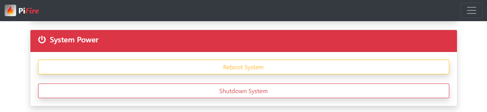

Below these controls, you'll see more information about the system hardware, system temperature, uptime, GPIO Pins, etc.  

#### Adding the App to your Homescreen using Chrome on your Android Phone

If you are an Android person, you are likely to be using Chrome on your phone and can not only setup a link to the web-app on your homescreen, but it also makes the interface look like a native application.  Pretty cool right?  Well here's how you set this up, it's very simple.  

First, navigate to the instance of the application in your Chrome browser on your phone.  Remember, it's as easy as going to the IP address that was assigned to you device.  Then, from the Chrome drop-down menu in the upper right of the screen, select "Add to Home screen".  

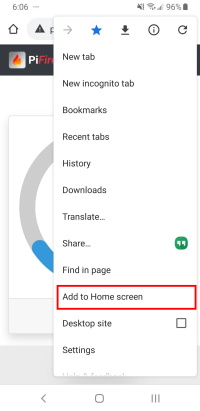

Then, when the new dialog box pops up, you will have the opportunity to rename the application, or keep the default.

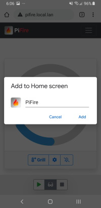

And there you have it, you've not only created a quick link to your web-app, but you've also created a pseudo application at the same time.

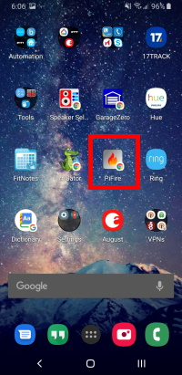

#### Additional Notes on Accessing the Application from Outside your Local Network

Please take the utmost care in considering options for exposing this application outside of your home network. Given that this application has very limited security built-in, anyone that is able to gain access to it directly or indirectly, may be able to control your hardware which could result in damage to your property or even potentially physical harm to someone nearby.  

If you want to have access to this application outside of your home network, and I haven't already convinced you not to do this, then I would recommend setting up a VPN for your local network.  This would allow you to tunnel to your home network and access all of your local equipment with some level of security.  A good, low cost, and dead simple VPN project I would recommend is [PiVPN](http://www.pivpn.io/).   

### Software Architecture

For the more adventurous of you, who want to tweak, extend and improve PiFire for your purposes, I've tried to architect PiFire in a way to make it friendly to use on different hardware.  

You may have noticed that we have a few modules that can be used interchangeably with a common API.

* **Grill Platform (grillplat_xxxx.py)**: Used for Input / Output with grill itself.  (i.e. Any Inputs (Buttons / Switche) and Relay Outputs for Fan, Auger, Igniter)
* **ADC (adc_xxxx.py)**: Used to get data for the different temperature probes (Grill, Probe1, Probe2).
* **Display (display_xxxx.py)**: Interface for the display.  Used to control and print information to the display.  

Adding this layer for these components allows you to create your own modules to support different ADC devices, Display Devices, and Grill configurations.

#### Prototyping

Each of the above modules has a prototype version *(i.e. grillplat_prototype.py)* which is used to test PiFire on other platforms (i.e. Windows, Linux or MacOS).  Input and output is simulated, and can be used in conjunction with your own modules for testing purposes.  To enable prototype mode, simply set `prototype_mode = True` at the top of `control.py`.  After this has been changed, the software can be run on nearly any platform (Linux, Windows, Mac, Raspberry Pi, etc.) as long as python3 and flask are installed.  

When prototyping, functionality, it's helpful to run control.py in one process and the app.py in another process.  This way you can access the PiFire webui via your web browser of choice and monitor the console output of the control.py script in a separate window.  

More to come in this section.  

### Future Ideas To Be (possibly) Implemented  

In this section, I'm going to keep a running list of ideas for possible upgrades for PiFire in the future.  No guarantees that these will be implemented, but it gives you some idea of what I have planned for the future.  

```
Known Issues
	* Issue where sometimes temperature readings from the ADC fail.  Not sure if this is an i2c bus problem or something else.  Does not effect overall functionality, but can be annoying when looking at the history data.  
	* Issue where if the history page is left open too long the auto-refresh may eventually cause the tab to crash with out of memory errors.  

Ideas for WebUI / App
	Dashboard
		New: Smoke+ Mode (Toggle Fan On/Off) - Experimental feature to increase smoke output by modulating the fan on/off time. This will require some experimentation.

	History
		New: Incorporate "streaming" instead of re-writing the chart every 3 seconds
		New: Annotation when mode changes?

	Recipes Page
		New: Custom Programs (or Recipes)
			Event Triggers (Pit Temp, Probe Temp, Timer) w/Notifications

	Debug interface for prototype testing
		New: Prototype Increase Temp, Decrease Temperature (Turn on/off outputs, inputs)

	Settings
		New: Name your Smoker (give your install a unique name)

	Admin
		New: Check for Updates / Pull latest updates from GitHub

	API
		New: API interface to control functions and return JSON data structures for status/history (could be used to develop an Android or iPhone native app) (partially implemented - read status only)

Ideas for Control process
	New: Smart Probe Enable (i.e. enable when plugged in, disable when unplugged)
	New: Physical Buttons / Control Dial for grill control while you are standing in front of it.  

Ideas for display
	New: Display Probe Temperature
	New: Display Not Connected to Internet Symbol if not connected
	New: Display IP Address (or QR Code?) https://pypi.org/project/qrcode/
	New: Larger display with more display capabilities
```

### Updates

* 9/2020 Initial Release

### Credits

Web Application created by Ben Parmeter, copyright 2020. Check out my other projects on [github](https://github.com/nebhead). If you enjoy this software and feel the need to donate a cup of coffee, a frosty beer or a bottle of wine to the developer you can click [here](https://paypal.me/benparmeter).

Of course, none of this project would be available without the wonderful and amazing folks below.  If I forgot anyone please don't hesitate to let me know.  

* **PiSmoker** - The project that served as the inspiration for this project and where the PID controller is wholesale borrowed from.  Special mention to Dan for providing encouraging feedback from day one of this project.  Many thanks!  Copyright Dan Borello. [engineeredmusings.com](http://engineeredmusings.com/pismoker/) [github](https://github.com/DBorello/PiSmoker)

* **Circliful** - Beautiful Circle Gauges on the dashboard. Extra special mention for Patric for providing great support to me via GitHub.  Copyright Patric Gutersohn & other contributors. [gutersohn.com](http://gutersohn.com/) [github](https://github.com/pguso/js-plugin-circliful)

* **Bootstrap** - WebUI Based on Bootstrap 4.  Bootstrap is released under the MIT license and is copyright 2018 Twitter. [getbootstrap.com](http://getbootstrap.com)

* **JQuery** - Required by Bootstrap. Copyright JS Foundation and other contributors. Released under MIT license. [jquery.org/license](https://jquery.org/license/)

* **Popper** - Required by Bootstrap. Copyright 2016, 2018 FEDERICO ZIVOLO & CONTRIBUTORS. Released under MIT license. [popper.js.org](https://popper.js.org/)

* **Chartjs** - For the fancy charts. Copyright 2018 Chart.js Contributors. Released under MIT license. [chartjs.org](https://chartjs.org/)

* **FontAwesome** - Amazing FREE Icons that I use throughout this project.  Copyright Font Awesome.  Released under the Font Awesome Free License. [fontawesome.com](https://fontawesome.com/) [github.com](https://github.com/FortAwesome/Font-Awesome)

* **Luma OLED** - The OLED display module for Python that I use.  This is not distributed in this project, but deserves a shout-out.  Copyright 2014-2020 Richard Hull and contributors. Released under MIT License. [readthedocs.io](https://luma-oled.readthedocs.io/en/latest/) [github.com](https://github.com/rm-hull/luma.oled)

* **ADS1115 Python Module** - Python module to support the ADS1115 16-Bit ADC. Also not actually distributed with this project, but also deserveds recognition.  Copyright David H Hagan. [pypi.com](https://pypi.org/project/ADS1115/) [github.com](https://github.com/vincentrou/ads1115_lib)

### Licensing

This project is licensed under the MIT license.

```
MIT License

Copyright (c) 2020 Ben Parmeter

Permission is hereby granted, free of charge, to any person obtaining a copy
of this software and associated documentation files (the "Software"), to deal
in the Software without restriction, including without limitation the rights
to use, copy, modify, merge, publish, distribute, sublicense, and/or sell
copies of the Software, and to permit persons to whom the Software is
furnished to do so, subject to the following conditions:

The above copyright notice and this permission notice shall be included in all
copies or substantial portions of the Software.

THE SOFTWARE IS PROVIDED "AS IS", WITHOUT WARRANTY OF ANY KIND, EXPRESS OR
IMPLIED, INCLUDING BUT NOT LIMITED TO THE WARRANTIES OF MERCHANTABILITY,
FITNESS FOR A PARTICULAR PURPOSE AND NONINFRINGEMENT. IN NO EVENT SHALL THE
AUTHORS OR COPYRIGHT HOLDERS BE LIABLE FOR ANY CLAIM, DAMAGES OR OTHER
LIABILITY, WHETHER IN AN ACTION OF CONTRACT, TORT OR OTHERWISE, ARISING FROM,
OUT OF OR IN CONNECTION WITH THE SOFTWARE OR THE USE OR OTHER DEALINGS IN THE
SOFTWARE.
```
