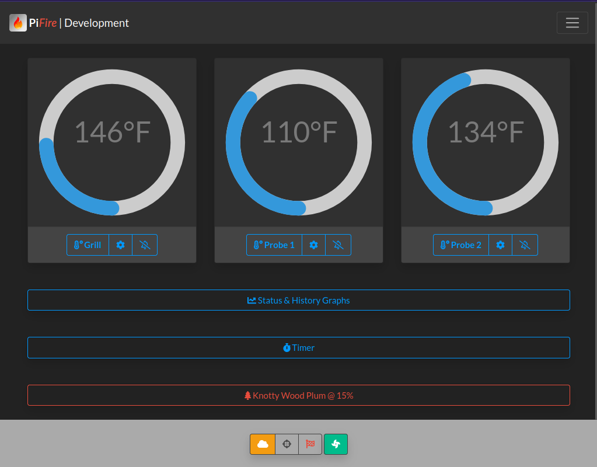
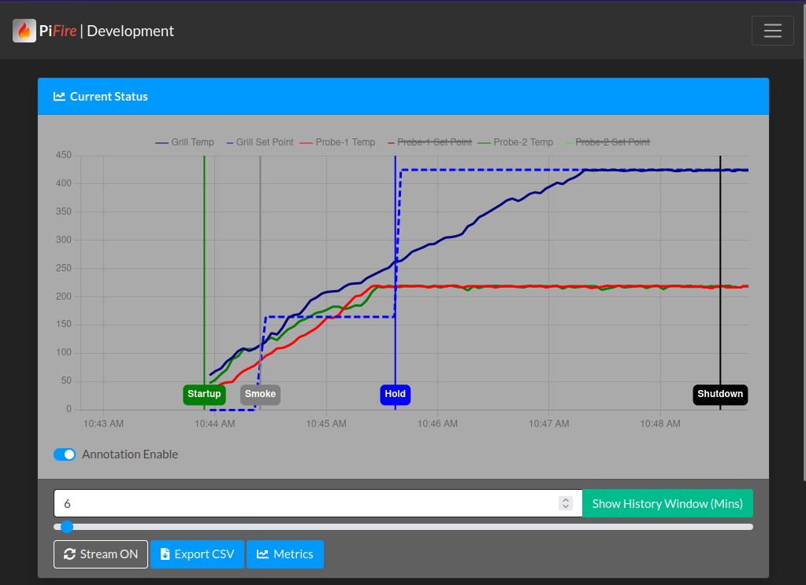
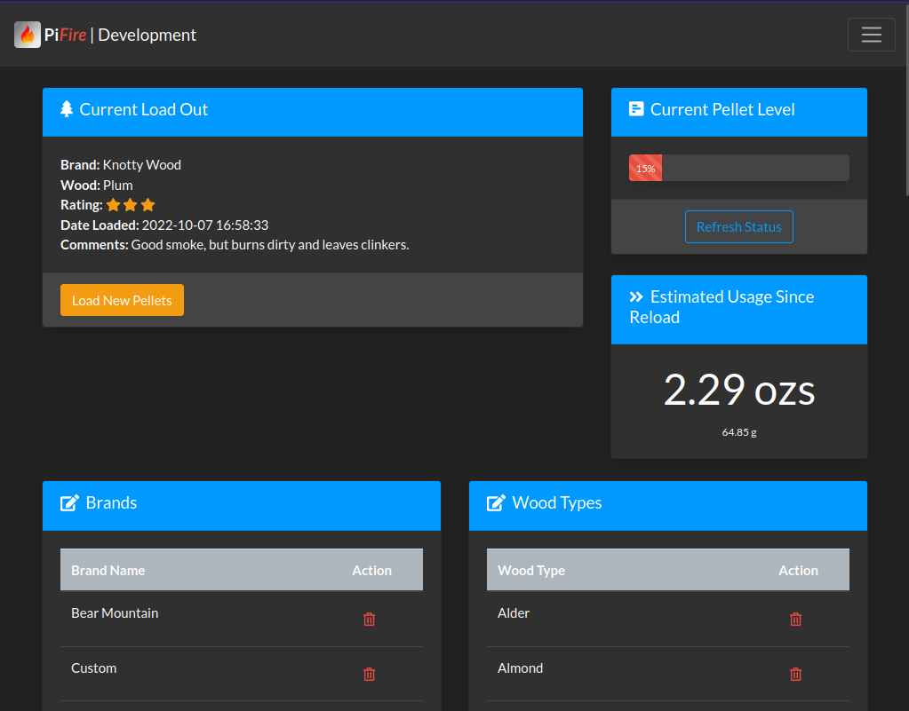
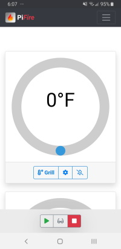
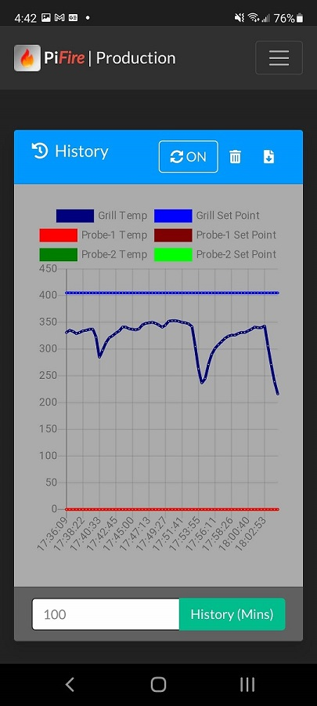
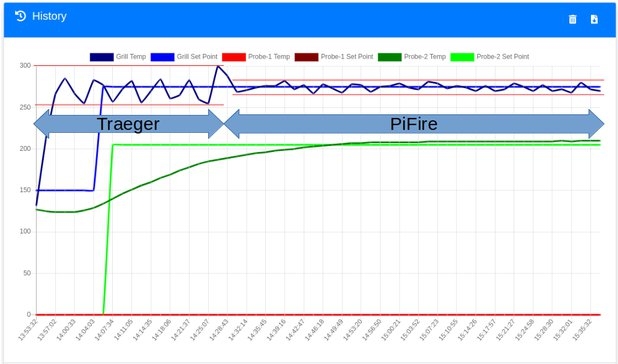
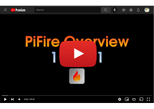
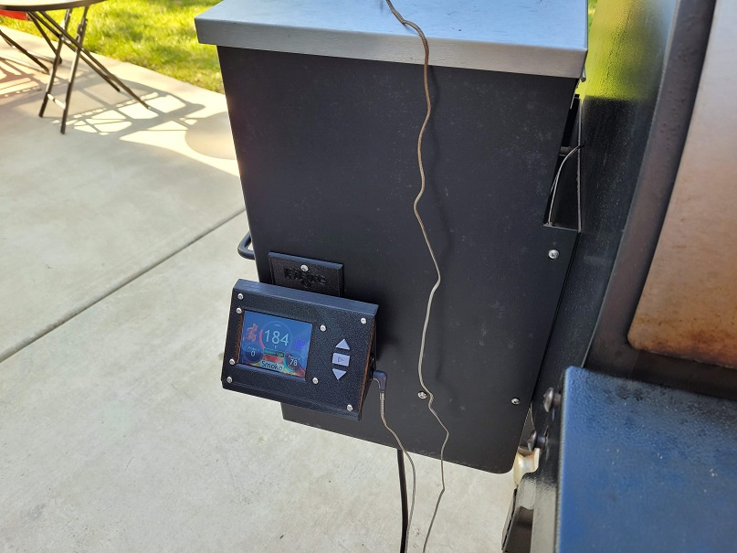

#  PiFire
## Raspberry Pi Zero W based Smoker Grill Controller

***Note:*** *This project is continuously evolving, and thus this readme will likely be improved over time, as I find the inspiration to make adjustments.  That being said, I'm sure there will be many errors that I have overlooked or sections that I haven't updated. This project is something I've done for both fun and for self-education.  If you decide to implement this project for yourself, and run into issues/challenges, feel free to submit an issue here on GitHub.  However, I would highly encourage you to dig in and debug the issue as much as you can on your own for the sake of growing your own knowledge.  Also, I have a very demanding day job, a family, and lots of barbecue to make - so please have patience with me.*

***Warning:*** *The creator of this project takes no responsibility for any damage that you may do to your personal property including modifications to your smoker grill if you choose to use this project.  The creator also takes no responsibility for any resulting harm or damages that may come from issues with the hardware or software design.*  ***This project is provided for educational purposes, and should be attempted only by individuals who wish to assume all risks involved.***

***Note: (2020-12-29)*** *Full documentation including hardware and software installation guide are now located [here](https://nebhead.github.io/PiFire/) at the [https://nebhead.github.io/PiFire/](https://nebhead.github.io/PiFire/).*

### Introduction
This project was inspired by user dborello and his excellent PiSmoker project (http://engineeredmusings.com/pismoker/ and https://github.com/DBorello/PiSmoker).  I encourage you to check it out and get a rough idea of how this all works.  This particular project was built around a Traeger Texas smoker grill platform, but should work for most older Traeger models (or other brands with similar parts like the older Pit Boss) built with similar parts (fan, auger, and igniter).  I've built the code in a way to be somewhat modular & extensible such that you can replace the grill platform with your own specific platform instead.  Newer Traeger grills with their newer wifi enabled controllers have DC components (instead of the AC Fan / Auger) and aren't covered by this project.  

Just as with the PiSmoker project, I had a few goals in mind.  I also wanted to have tighter temperature controls, wireless control, and plotting of the grill / meat temperatures.  In addition, I wanted to design this project such that original smoker controller could be used if needed.  This way, if I wanted to, I could use my controller as a monitoring device for temperatures instead of controlling the temperature and leave that up to the original controller.  Basically, it was my fallback plan in case my project didn't work out, or if I wanted to do a quick cook on the Traeger without using the fancy GUI.  **UPDATE (11/2021)** After spending lots of time with PiFire, I've finally removed the original controller in favor of using PiFire exclusively.  However, this doesn't mean that you can't still retain your original controller if you want.  Both modes work fine. 

### Features

* WiFi Enabled Access & Control (WebUI) via computer, phone or tablet
* Multiple Cook Modes
	* _Startup Mode_ (fixed auger on times with igniter on)
	* _Smoke Mode_ (fixed auger on times)
	* _Hold Mode_ (variable auger on times) using PID for higher accuracy
	* _Shutdown Mode_ (auger off, fan on) to burn off pellets after cook is completed
	* _Monitor Mode_ - See temperatures of grill / probes and get notifications if using another controller or if just checking the temperatures any time.  
	* _Manual Mode_ - Control fan, auger and igniter manually.  
	* _Prime_ - Allows you to prime the firepot with pellets prior to a cook.  
* Supports several different OLED and LCD screens
	* SSD1306 OLED Display
	* ST7789 TFT Display
	* ILI9341 TFT Display (now with more rotation options)
* Physical Button Input / Control (depending on the display, three button inputs)
* Encoder support for, so you can control your grill with a spinny knob.
* One (1) Grill Probe and Many Food Probes
	* Tunable probe inputs to allow for many different probe manufacturers
	* Supports the ADS1115 ADC, ADS1015 ADC, and MAX31865 RTD devices for measuring probes
	* Probe tuning tool to help develop probe profiles
	* **NEW!** - Any number of probe inputs, limited only by the number of devices that the Raspberry Pi can support
	* **NEW!** - Virtual Probes to allow you to do things like averaging probes, finding highest and lowest values of certain probes, etc.
* Cook Timer - Moved to the Top Bar for Easy Access
* Notifications (Grill / Food Probes / Timer)
	* Supports Apprise, IFTTT, Pushover, and Pushbullet Notification Services
* Smoke Plus Feature to deliver more smoke during Smoke / Hold modes
* Safety settings to prevent over-temp, startup failure, or firepot flameout (and overload)
* Save temperature history for all probes / set points to a cook file that can be updated with images, notes, and even downloaded to your devices.
* Wood Pellet Tracking Manager - Now includes estimates of pellet usage.
* Pellet Level Sensor Support
	* VL53L0X Time of Flight Sensor
	* HCSR04 Ultrasonic Sensor
* Socket IO for Android Application Support _(GitHub User [@weberbox](https://github.com/weberbox) has made a Android client app under development here: [https://github.com/weberbox/PiFire-Android](https://github.com/weberbox/PiFire-Android))_ **(NOTE: Due to the large amount of architectural changes in v1.5.0, the Android App update is still in development.  The current version of PiFire has implemented a compatibility layer so that it doesn't break compatibility with the current Android App.  If you have a non-standard probe setup or more than two food probes, you may see issues.  There may still be bugs, so please do submit issues on GitHub if you experience any.)**
* **NEW!** Recipes / Recipe Mode - Integrated recipe creation and a new mode for developing a recipe 'program' that will control the grill for you and follow the recipe that was programmed.  
* **NEW!** Updated and re-written dashboards.  The dashboard has been refreshed with a new look.  New 'basic' and 'default' dashboards. If you are technically inclined, you can even develop your own dashboard.  
* **NEW!** Control panel everywhere! Allow your control panel to be displayed on almost all pages in PiFire.
* **NEW!** Lid open detection during hold mode to pause the controller and prevent overshoots.  
* ...And much more!  

### Screenshots & Videos

The dashboard is where most of your key information and controls are at.  This is the screen that greets you when you access the PiFire WebUI on your computer, smart phone or tablet in a browser.



For those of us who like to see the data, PiFire allows you to graph and save your cook history.  It's also a great way to monitor your cook in realtime.  



PiFire also provides an optional Pellet Manager which can help you track your pellet usage, store ratings, check your pellet level if you have a pellet sensor equipped.  



This is what PiFire looks like on your mobile device.  And in these screen shots you'll notice that we have dark mode enabled.  This helps for viewing at night, or just if you like the dark theme better.  Personally I think it looks pretty slick.  





Below is an example comparison that I did on a real cook of the Traeger controller attempting to hold 275F and the PiFire holding at the same temperature.  The difference is very impressive.  The Traeger swings massively up to 25F over and under the set temperature.  However the PID in from PiSmoker does a great job holding roughly +-7 degrees.  And this is without any extra tuning. 



Here's a brief YouTube video giving a basic overview of the PiFire web interfaces.

### PiFire Overview Video

I recommend at least taking a peek at the PiFire overview video below.  It covers the basics of operation, settings and control.  

[](https://youtu.be/zifl0_sfFBA)

[Link to our channel on YouTube](https://www.youtube.com/channel/UCYYs50U5QvHHhogx_rqs0Yg)

Here is a the latest version 2.0 of the hardware w/TFT screen and hardware buttons in a custom 3D printed enclosure. We've come a long way since v1.0.



And if you're interested in seeing more builds from other users, we have a discussions thread [here](https://github.com/nebhead/PiFire/discussions/28) where others have posted pictures of their unique builds.  

## Full Documentation / Hardware and Software Installation

The full documentation has been moved to a GitHub page here: [https://nebhead.github.io/PiFire/](https://nebhead.github.io/PiFire/)

### Discord
I've added a discord server [here](https://discord.gg/F9mbCrbrZS) which can be a great resource for all who want to get more information, want to share their own builds, or just chat about pellet cooking.  Looking forward to seeing you there. 

### Updates

* 9/2020 - Initial Release
* 12/2020 - Moved documentation to [https://nebhead.github.io/PiFire/](https://nebhead.github.io/PiFire/)
* 11/2021 - Many new features, bug fixes, and improvements.  New hardware support etc. which have been in incorporated over the last year, have been merged from the development branch
* 4/2022 - Release v1.3.1 - Another HUGE release with many new features including an updater, a new configuration wizard, bug fixes, Smart Start feature and much, much more!
* 6/2022 - Release v1.3.3 - Lot's of changes for this latest stable release for June 2022. It's been a busy couple of months and we've had a few bug fixes pulled into this latest version, including an installer bug. The display modules have been completely overhauled in this latest release to improve responsiveness and capabilities. We've added a module for the ILI1394 with rotary encoder support, which is a nice option for those who like to use a dial with push button to interface the menu system. When doing the update, consider doing a full reboot (instead of just restarting the server) to ensure connected display devices are fully reset.
* 7/2022 - Release v1.3.4 - Another monthly release with some bug fixes and some new features. The biggest new feature of this month was the addition of Annotations in the history graph. This gives you helpful tags on the graph (see below) with indicators of the mode changes. Of course you can turn this off in the history page if you don't like it.
* 10/2022 - Release v1.3.5 - Bug fixes, feature refinements and brand new features galore in this latest release.  Added a new ADS1115 module (using Adafruits Circuit Python), due to some reports of issues with the existing ADS1115 module. These can be optionally selected in the configuration wizard.  PWM Fan Support and a boatload of code cleanup was introduced, thanks to contributor @weberbox.  Support for saving cook files was introduced in this version, so that you can go back to older cooks, edit some of the information and add images and comments.  Added a Prime Mode to allow you to prime the fire pot with pellets prior to a cook, and even prime & startup.  Added estimated pellet usage to the pellet manager, which will attempt to track just how many pellets you have used since your last load of pellets.  Added Apprise notification capability thanks to contributor @calonmerc.  320x200 displays have been update and added timers to specific modes. And even more!  
* **6/2023** - Release v1.5.0 - Arguably one of the biggest overhauls to PiFire since it's inception.  The Probe system has been completely refactored to allow for multiple probe sensing devices (i.e. ADS1115, MAX31865, or even Virtual Probes to augment your inputs).  This extension of the probe system, allows for any number of probe inputs to be tracked in PiFire, allowing from notifications and tracking of history for each probe.  The sky is the limit!  With this change the the probe architecture, a number of other things needed to be modified/updated, including the notification system, the history/charting, the dashboards, cookfiles and recipe modes.  Note that if you are updating to this version, your settings will be upgraded in the process and you will not be able to roll back to a previous version (unless you restore from a backup of your settings).  

### Credits

Web Application created by Ben Parmeter, copyright 2020-2023. Check out my other projects on [github](https://github.com/nebhead). If you enjoy this software and feel the need to donate a cup of coffee, a frosty beer or a bottle of wine to the developer you can click [here](https://paypal.me/benparmeter).

Of course, none of this project would be available without the wonderful and amazing folks below.  If I forgot anyone please don't hesitate to let me know.  

* **PiSmoker** - The project that served as the inspiration for this project and where the PID controller is wholesale borrowed from.  Special mention to Dan for providing encouraging feedback from day one of this project.  Many thanks!  Copyright Dan Borello. [engineeredmusings.com](http://engineeredmusings.com/pismoker/) [github](https://github.com/DBorello/PiSmoker)

* **Circliful** - Beautiful Circle Gauges on the dashboard. Extra special mention for Patric for providing great support to me via GitHub.  Copyright Patric Gutersohn & other contributors. [gutersohn.com](http://gutersohn.com/) [github](https://github.com/pguso/js-plugin-circliful)

* **SVG Gauge** - Credits to Aniket Naik for the excellent SVG-Gauge. Released under the MIT License Copyright (c) 2016 [(github profile)](https://github.com/naikus) [github.com](https://github.com/naikus/svg-gauge)

* **Bootstrap Color Picker** - Color picker for configuring the chart line colors. Copyright (c) 2017 Javi Aguilar. Released under MIT license. [github](https://github.com/itsjavi/bootstrap-colorpicker)

* **Bootstrap** - WebUI Based on Bootstrap 4.  Bootstrap is released under the MIT license and is copyright 2018 Twitter. [getbootstrap.com](http://getbootstrap.com)

* **JQuery** - Required by Bootstrap. Copyright JS Foundation and other contributors. Released under MIT license. [jquery.org/license](https://jquery.org/license/)

* **Popper** - Required by Bootstrap. Copyright 2016, 2018 FEDERICO ZIVOLO & CONTRIBUTORS. Released under MIT license. [popper.js.org](https://popper.js.org/)

* **Chartjs** - For the fancy charts. Copyright 2018 Chart.js Contributors. Released under MIT license. [chartjs.org](https://chartjs.org/)

* **FontAwesome** - Amazing FREE Icons that I use throughout this project.  Copyright Font Awesome.  Released under the Font Awesome Free License. [fontawesome.com](https://fontawesome.com/) [github.com](https://github.com/FortAwesome/Font-Awesome)

* **Luma OLED** - The OLED display module for Python that I use.  This is not distributed in this project, but deserves a shout-out.  Copyright 2014-2020 Richard Hull and contributors. Released under MIT License. [readthedocs.io](https://luma-oled.readthedocs.io/en/latest/) [github.com](https://github.com/rm-hull/luma.oled)

* **ADS1115 Python Module** - Python module to support the ADS1115 16-Bit ADC. Also not actually distributed with this project, but also deserveds recognition.  Copyright David H Hagan. [pypi.com](https://pypi.org/project/ADS1115/) [github.com](https://github.com/vincentrou/ads1115_lib)

* **Other Adafruit Modules** - Multiple Adafruit modules were also leveraged in the making of this project and deserve recognition, even if they aren't distributed in the project.  

* **Contributions from the Community** - Thank you to those of you who have rolled up your sleeves, built out this project and contributed back. Whether that be with contributions to the code, designing new hardware, ideas and suggestions, or with a coffee that you bought me along the way.  Thank you very much, you keep this project running!

### Licensing

This project is licensed under the MIT license.

```
MIT License

Copyright (c) 2020 - 2023 Ben Parmeter and Contributors

Permission is hereby granted, free of charge, to any person obtaining a copy
of this software and associated documentation files (the "Software"), to deal
in the Software without restriction, including without limitation the rights
to use, copy, modify, merge, publish, distribute, sublicense, and/or sell
copies of the Software, and to permit persons to whom the Software is
furnished to do so, subject to the following conditions:

The above copyright notice and this permission notice shall be included in all
copies or substantial portions of the Software.

THE SOFTWARE IS PROVIDED "AS IS", WITHOUT WARRANTY OF ANY KIND, EXPRESS OR
IMPLIED, INCLUDING BUT NOT LIMITED TO THE WARRANTIES OF MERCHANTABILITY,
FITNESS FOR A PARTICULAR PURPOSE AND NONINFRINGEMENT. IN NO EVENT SHALL THE
AUTHORS OR COPYRIGHT HOLDERS BE LIABLE FOR ANY CLAIM, DAMAGES OR OTHER
LIABILITY, WHETHER IN AN ACTION OF CONTRACT, TORT OR OTHERWISE, ARISING FROM,
OUT OF OR IN CONNECTION WITH THE SOFTWARE OR THE USE OR OTHER DEALINGS IN THE
SOFTWARE.
```
