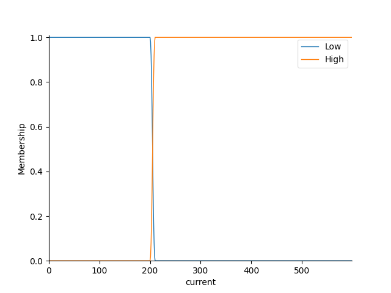
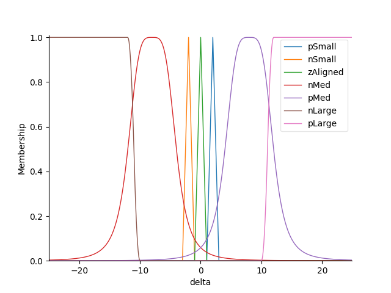
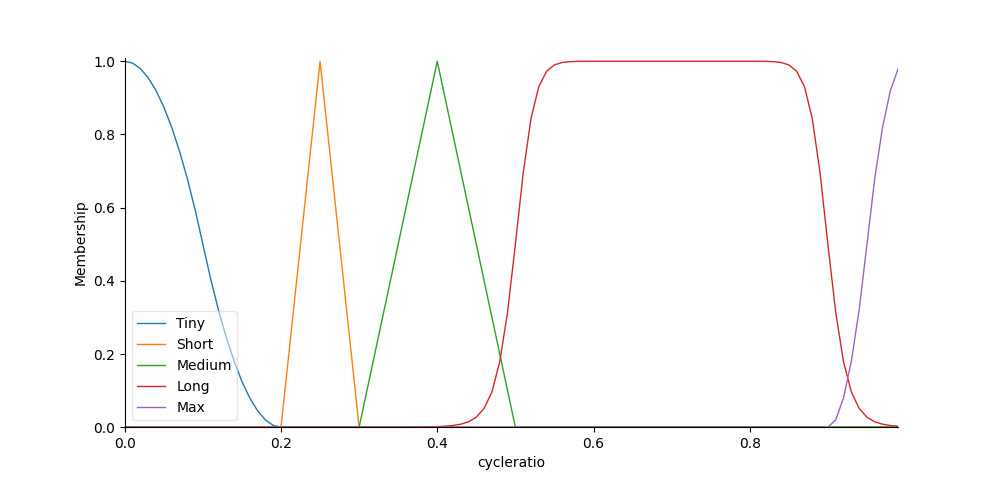

## Fuzzy Logic Controller

Included with the pluggable controller release is the addition of an experimental Fuzzy Logic based controller.  As the name implies, this controller uses the concept of Fuzzy Logic to act as a controller.  Without getting into the details of how Fuzzy Logic works, it is a way to more easily define a system, using plain language instead of complex mathematics. (The math is still there, but it's sort of obfuscated)

The theory for this controller is that we can define our inputs broadly (current temperature, the setpoint, perhaps even the rate of temperature change), then adjust the auger ON time (output) accordingly to get to the setpoint and stay there.  

```note
If this controller is used in Celsius mode, it will convert both the set point and the current temperature inputs to Fahrenheit before calculations are done. 
```

Inputs are called Antecedents and are defined as follows:

+ Current Temperature: 
  + Low = Anything less than 200F
  + High = Anything greater than 200F



+ Delta Temperature (Set Point - Current): 
  + Negative Large - The current temperature is much higher than the set point
  + Negative Medium - The current temperature is moderately higher than the set point
  + Negative Small - The current temperature is slightly higher than the set point
  + Zero Aligned - The current temperature is at the set point 
  + Positive Small - The Current temperature is slightly lower than the set point 
  + Positive Medium - The current temperature is moderately lower than the set point 
  + Positive Large - the current temperature is much lower thant he set point 



The output is called a Consequent and are defined as follows: 

+ Cycle Ratio:
  + Tiny - Cycle ratios between 0.0 and 0.2
  + Short - Cycle ratios between 0.2 and 0.3
  + Medium - Cycle ratios between 0.3 and 0.5
  + Long - Cycle ratios between 0.5 and 0.9
  + Max - Cycle ratios between 0.9 and 1.0



Using the SciKit Fuzzy controller, we are able to develop rules to help us define what the controller should do with this data.  The rules are defined as follows:

+ Rules for ramping up 
  - If the Delta Temp is Positive Large then Cycle Ratio is Max
  - If the Delta Temp is Positive Medium then Cycle Ratio is Medium

+ Rules for centering 
  - If the Delta Temp is Positive Small AND Current Temp is High then Cycle Ratio is Medium 
  - If the Delta Temp is Positive Small AND Current Temp is Low then Cycle Ratio is Short
  - If the Delta Temp is Negative Small AND Current Temp is High OR Current Temp is Low then Cycle Ratio is Tiny 
  - If the Delta Temp is Zero Aligned AND Current Temp is High OR Current Temp is Low then Cycle Ratio is Tiny 

+ Rules for ramping down
  - If the Delta Temp is Negative Large AND Current Temp is High then Cycle Ratio is Tiny
  - If the Delta Temp is Negative Large AND Current Temp is Low then Cycle Ratio is Tiny
  - If the Delta Temp is Negative Medium AND Current Temp is High then Cycle Ratio is Short
  - If the Delta Temp is Negative Medium AND Current Temp is Low then Cycle Ratio is Tiny

These rules are experimental right now and are subject to change in the future as testing continues.  In addition, it may be possible to add other Antecedents and Rules to this model to help refine the output, such as rate-of-change for temperature (negative and positive).  

Because computing the rules and creating this model can be computationally difficult for a Raspberry Pi Zero W, the model is saved off as a pickle file (`./controller/fuzzy.pickle`).  This can be recalled quickly, during runtime, so that it does not need to be recomputed every time the HOLD mode is engaged.  However, if any changes are made to the model antecedents, consequent or rules, then the pickle file should be re-generated.  This can be done using the `update_fuzzy.py` program in the root of the PiFire folder.  This can be run from the command line (preferably not while PiFire is running) on the PiFire instance, or can be run on a PC(which can usually create the model in under a second).  You can simply clone PiFire to your PC, install the dependencies (i.e. skfuzzy), go to the controllers folder and run `update_fuzzy.py`.  You can transfer the `fuzzy.pickle` file back to your PiFire, and place it in the `/usr/local/bin/PiFire/controller/` folder, replacing the older version.

```note
If you want to generate plots of the member functions, you can run the update_fuzzy.py with the -p option.  This argument will utilize matplotlib to generate member function plots to the screen if you have matplotlib installed - again this is not recommended to do on the Raspberry Pi that you are running on and is better done on a standalone PC.
```
